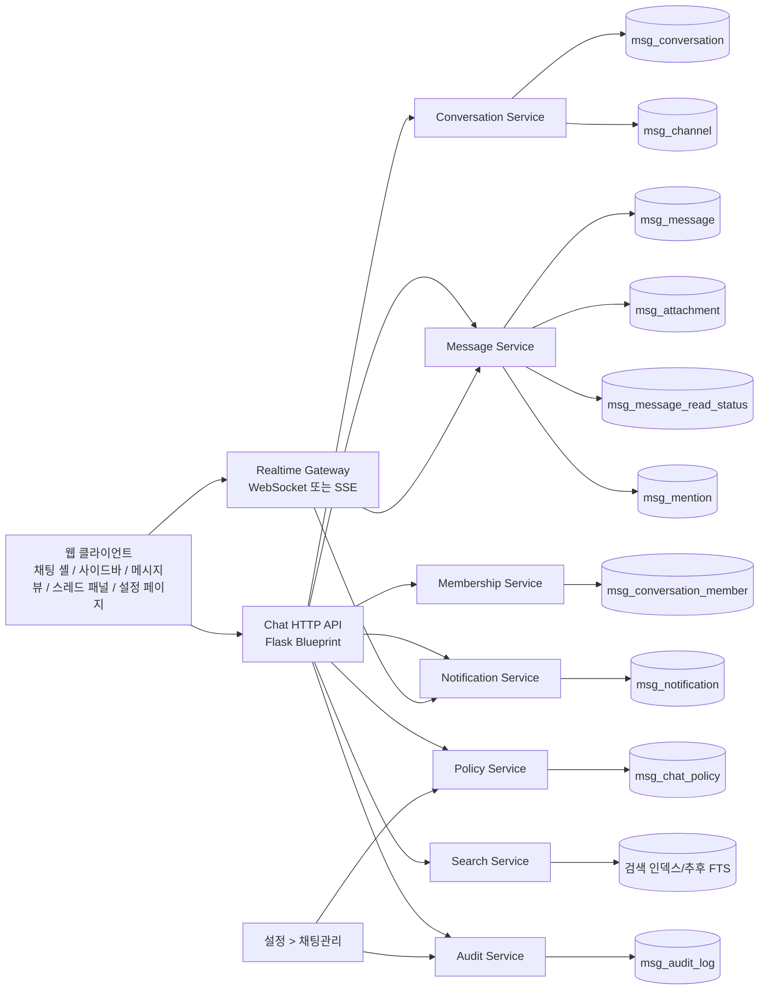

# Blossom 채널 중심 협업 메신저 아키텍처 설계

## 1. 현재 구현 기준점

현재 채팅은 다음 자산을 기준으로 동작한다.

- 화면: `app/templates/addon_application/3.chat.html`
- 클라이언트: `static/js/addon_application/3.chat.js`
- API: `app/routes/api.py` 내 `/api/chat/*`
- 모델: `app/models.py` 의 `MsgRoom`, `MsgRoomMember`, `MsgMessage`, `MsgFile`

현 구조는 이미 "대화방 + 멤버 + 메시지" 형태이므로 완전 재구축보다 `Room -> Conversation`, `DIRECT/GROUP -> DM/CHANNEL/THREAD` 일반화가 가장 안전하다. 즉, 기존 1:1 채팅은 버리지 않고 DM으로 흡수하고, 채널과 스레드를 같은 메시징 도메인 아래에 추가하는 방식이 적합하다.

---

## 2. 목표 아키텍처

### 핵심 원칙

- 기본 축은 사람 중심이 아니라 채널 중심이다.
- DM은 보조 수단이지만 동일한 메시징 엔진을 사용한다.
- 읽음, 멘션, 알림, 감사 로그는 메시지 저장과 분리된 독립 서브도메인으로 설계한다.
- 권한은 RBAC + 리소스 스코프 기반으로 분리한다.
- 대용량 메시지 처리를 위해 커서 기반 페이지네이션과 지연 로딩을 기본으로 한다.
- Flask 단일 앱 구조는 유지하되, API 레이어와 도메인 서비스 레이어를 분리해 점진적으로 확장한다.

### 전체 아키텍처 다이어그램



### 논리 계층

1. Presentation
   - `/addon/chat` 채팅 UI
   - `설정 > 채팅관리` 운영 UI

2. API
   - 채널, DM, 스레드, 메시지, 알림, 검색, 정책 API

3. Domain Services
   - ConversationService
   - ChannelService
   - MembershipService
   - MessageService
   - ThreadService
   - NotificationService
   - PolicyService
   - AuditService

4. Infrastructure
   - SQLAlchemy 모델/리포지토리
   - 파일 저장소
   - 실시간 이벤트 브로커
   - 검색 인덱스

---

## 3. 도메인 모델

### Conversation 타입

- `DM`
  - 1:1 또는 그룹 DM
  - 기존 `DIRECT`, `GROUP` 을 이 타입으로 흡수
- `CHANNEL`
  - `public`, `private`
  - 협업의 기본 단위
- `THREAD`
  - 상위 메시지에 종속된 하위 대화
  - 독립 테이블 또는 `parent_message_id` 기반 구현 가능

### 핵심 엔티티

- User
- Conversation
- Channel
- ConversationMember 또는 ChannelMember
- Message
- Thread
- MessageReadStatus
- Attachment
- Mention
- Notification
- ChatPolicy
- AuditLog

### 권장 관계

- `Conversation 1:N ConversationMember`
- `Conversation 1:N Message`
- `Message 1:N Attachment`
- `Message 1:N Mention`
- `Message 1:N MessageReadStatus`
- `Message 1:N ThreadMessage`
- `Channel 1:1 Conversation`
- `Notification N:1 User`

---

## 4. DB 스키마 상세 정의

현재 `msg_room`, `msg_room_member`, `msg_message`, `msg_file` 를 다음 방향으로 확장한다.

### 4.1 msg_conversation

채팅의 최상위 엔티티. 기존 `MsgRoom` 대체.

| 컬럼 | 타입 | 설명 |
|---|---|---|
| id | bigint PK | 대화 ID |
| conversation_type | varchar(16) | `DM`, `CHANNEL`, `THREAD` |
| visibility | varchar(16) | `public`, `private`, `direct` |
| title | varchar(255) | 채널명 또는 DM 표시명 |
| description | text | 설명 |
| owner_user_id | bigint FK | 생성자 |
| parent_conversation_id | bigint FK nullable | 스레드/서브대화 확장용 |
| parent_message_id | bigint FK nullable | THREAD 시작 메시지 |
| dm_key | varchar(255) unique nullable | 기존 `direct_key` 승계 |
| last_message_id | bigint FK nullable | 마지막 메시지 |
| last_message_preview | text | 목록 미리보기 |
| last_message_at | datetime | 정렬 기준 |
| is_archived | bool | 채널 보관 여부 |
| is_deleted | bool | 소프트 삭제 |
| created_at | datetime | 생성일 |
| created_by | bigint FK | 생성자 |
| updated_at | datetime | 수정일 |
| updated_by | bigint FK | 수정자 |

### 4.2 msg_channel

채널 전용 메타. 요구사항의 `Channel` 을 충족한다.

| 컬럼 | 타입 | 설명 |
|---|---|---|
| id | bigint PK | 채널 ID |
| conversation_id | bigint FK unique | 상위 Conversation |
| name | varchar(120) unique | 채널명, 예: `infra-ops` |
| slug | varchar(140) unique | URL/검색용 키 |
| type | varchar(16) | `public`, `private` |
| description | text | 채널 설명 |
| topic | varchar(255) | 현재 주제 |
| created_by | bigint FK | 생성자 |
| created_at | datetime | 생성일 |
| archived_at | datetime nullable | 보관 시각 |

최소 요구 필드 대응:

- `id, name, type(public/private), description, createdBy, createdAt`

### 4.3 msg_conversation_member

`ChannelMember` 와 `DM` 멤버십을 통합한다. 채널 전용 조회 시 `channel_id` 를 projection 으로 제공한다.

| 컬럼 | 타입 | 설명 |
|---|---|---|
| id | bigint PK | 멤버십 ID |
| conversation_id | bigint FK | 대화 ID |
| user_id | bigint FK | 사용자 |
| role | varchar(32) | `owner`, `admin`, `member`, `guest` |
| joined_at | datetime | 참여 시각 |
| left_at | datetime nullable | 탈퇴 시각 |
| mute_until | datetime nullable | 알림 음소거 |
| is_favorite | bool | 즐겨찾기 |
| notification_level | varchar(32) | `all`, `mentions`, `none` |
| last_read_message_id | bigint nullable | 빠른 unread 계산용 커서 |
| last_read_at | datetime nullable | 마지막 읽음 |
| unread_count_cached | int | 캐시 |

채널 최소 요구 필드 대응:

- `id, channelId, userId, role(admin/member), joinedAt`

### 4.4 msg_message

기존 `MsgMessage` 확장. 메시지 본문과 스레드 연결점 담당.

| 컬럼 | 타입 | 설명 |
|---|---|---|
| id | bigint PK | 메시지 ID |
| conversation_id | bigint FK | 채널/DM/스레드 소속 |
| sender_id | bigint FK | 발신자 |
| parent_message_id | bigint FK nullable | 스레드 댓글이면 상위 메시지 |
| root_message_id | bigint FK nullable | 스레드 루트 메시지 |
| content | text | 본문 |
| type | varchar(32) | `text`, `file`, `system`, `image`, `emoji` |
| status | varchar(16) | `active`, `deleted`, `blocked` |
| edited_at | datetime nullable | 수정 시각 |
| deleted_at | datetime nullable | 삭제 시각 |
| created_at | datetime | 생성 시각 |
| updated_at | datetime nullable | 수정 시각 |
| metadata_json | text nullable | 클라이언트 확장 필드 |

최소 요구 필드 대응:

- `id, conversationId(channelId or dmId), senderId, content, type(text/file), createdAt, updatedAt, deletedAt`

### 4.5 msg_thread_link 또는 parent_message_id 구조

권장안은 `msg_message.parent_message_id` 단일 구조다. 조회 최적화가 필요하면 보조 테이블을 둔다.

옵션 A. 단일 컬럼 방식

- `msg_message.parent_message_id`
- 장점: 단순, 현재 모델에 붙이기 쉬움
- 권장: 1차 도입안

옵션 B. 별도 `msg_thread_link`

| 컬럼 | 타입 | 설명 |
|---|---|---|
| id | bigint PK | 스레드 링크 ID |
| parent_message_id | bigint FK | 원본 메시지 |
| message_id | bigint FK | 스레드 메시지 |
| created_at | datetime | 생성 시각 |

최소 요구 필드 대응:

- `id, parentMessageId, messageId`

### 4.6 msg_message_read_status

메시지별 읽음 상세 이력. 기존 `last_read_message_id` 는 빠른 계산용 캐시로 유지.

| 컬럼 | 타입 | 설명 |
|---|---|---|
| id | bigint PK | 읽음 ID |
| message_id | bigint FK | 메시지 |
| user_id | bigint FK | 사용자 |
| read_at | datetime | 읽은 시각 |

최소 요구 필드 대응:

- `id, messageId, userId, readAt`

### 4.7 msg_attachment

기존 `MsgFile` 확장.

| 컬럼 | 타입 | 설명 |
|---|---|---|
| id | bigint PK | 첨부 ID |
| message_id | bigint FK | 메시지 |
| file_name | varchar(255) | 원본 파일명 |
| file_size | bigint | 크기 |
| file_type | varchar(120) | MIME 또는 논리 타입 |
| storage_key | varchar(1024) | 내부 저장 경로 |
| url | varchar(1024) | 다운로드 URL |
| preview_url | varchar(1024) nullable | 미리보기 URL |
| checksum | varchar(128) nullable | 무결성 검증 |
| uploaded_by | bigint FK | 업로더 |
| uploaded_at | datetime | 업로드 시각 |

최소 요구 필드 대응:

- `id, messageId, fileName, fileSize, fileType, url`

### 4.8 msg_mention

| 컬럼 | 타입 | 설명 |
|---|---|---|
| id | bigint PK | 멘션 ID |
| message_id | bigint FK | 메시지 |
| mentioned_user_id | bigint FK nullable | 사용자 멘션 |
| mentioned_scope | varchar(32) | `user`, `channel`, `here` |
| raw_token | varchar(120) | 예: `@kim`, `@channel` |
| created_at | datetime | 생성 시각 |

최소 요구 필드 대응:

- `id, messageId, mentionedUserId`

### 4.9 msg_notification

| 컬럼 | 타입 | 설명 |
|---|---|---|
| id | bigint PK | 알림 ID |
| user_id | bigint FK | 수신자 |
| notification_type | varchar(32) | `mention`, `channel_message`, `invite`, `thread_reply` |
| reference_type | varchar(32) | `message`, `channel`, `conversation` |
| reference_id | bigint | 대상 ID |
| title | varchar(255) | 제목 |
| body | text | 본문 |
| is_read | bool | 읽음 여부 |
| delivered_at | datetime nullable | 푸시 전달 시각 |
| read_at | datetime nullable | 읽은 시각 |
| created_at | datetime | 생성 시각 |

### 4.10 msg_chat_policy

운영자가 제어하는 정책 저장소.

| 컬럼 | 타입 | 설명 |
|---|---|---|
| id | bigint PK | 정책 ID |
| policy_key | varchar(120) unique | 정책 키 |
| policy_group | varchar(64) | `basic`, `channel`, `message`, `file`, `notification`, `retention`, `audit` |
| value_json | text | 정책 값 |
| updated_at | datetime | 변경 시각 |
| updated_by | bigint FK | 변경자 |

### 4.11 msg_audit_log

보안/감사 추적 전용 로그.

| 컬럼 | 타입 | 설명 |
|---|---|---|
| id | bigint PK | 로그 ID |
| actor_user_id | bigint FK | 수행자 |
| action | varchar(64) | `message.delete`, `channel.create`, `file.upload` |
| target_type | varchar(32) | `message`, `channel`, `policy` |
| target_id | bigint | 대상 ID |
| before_json | text nullable | 변경 전 |
| after_json | text nullable | 변경 후 |
| ip_address | varchar(64) | 접속 IP |
| user_agent | text | UA |
| created_at | datetime | 수행 시각 |

### 인덱스 권장안

- `msg_conversation(conversation_type, visibility, last_message_at desc)`
- `msg_channel(name)` unique
- `msg_conversation_member(conversation_id, user_id)` unique
- `msg_message(conversation_id, created_at desc, id desc)`
- `msg_message(parent_message_id, created_at asc)`
- `msg_message_read_status(message_id, user_id)` unique
- `msg_notification(user_id, is_read, created_at desc)`
- `msg_mention(mentioned_user_id, created_at desc)`

---

## 5. API 명세

REST 기준으로 제안한다. 현재 `/api/chat/*` 를 유지하되, 새 구조는 `/api/chat/v2/*` 로 병행 운영 후 전환하는 것이 안전하다.

### 5.1 Channel API

#### POST /api/chat/v2/channels

채널 생성.

요청 예시:

```json
{
  "name": "infra-ops",
  "type": "public",
  "description": "인프라 운영 협업 채널",
  "memberIds": [12, 18, 24]
}
```

응답:

- `201 Created`
- 채널 메타 + conversation 정보 + 초기 멤버 목록

#### GET /api/chat/v2/channels

내가 참여 가능한 채널 목록.

쿼리:

- `type=public|private`
- `q=`
- `cursor=`
- `limit=`
- `includeArchived=`

#### GET /api/chat/v2/channels/{id}

채널 상세, 멤버 수, 최근 메시지 메타, pinned 개수, 파일 개수 포함.

#### POST /api/chat/v2/channels/{id}/invite

채널 초대.

```json
{
  "userIds": [33, 34],
  "role": "member"
}
```

#### POST /api/chat/v2/channels/{id}/leave

현재 사용자의 채널 탈퇴.

```json
{
  "reason": "self_leave"
}
```

#### 추가 권장 API

- `PATCH /api/chat/v2/channels/{id}`
- `POST /api/chat/v2/channels/{id}/archive`
- `GET /api/chat/v2/channels/{id}/members`
- `PATCH /api/chat/v2/channels/{id}/members/{userId}`
- `DELETE /api/chat/v2/channels/{id}/members/{userId}`

### 5.2 DM API

기존 1:1 대화를 유지하기 위한 별도 진입점.

- `POST /api/chat/v2/dms`
- `GET /api/chat/v2/dms`
- `GET /api/chat/v2/dms/{id}`

요청 예시:

```json
{
  "participantIds": [12, 18],
  "title": null
}
```

### 5.3 Message API

#### GET /api/chat/v2/messages?conversationId=

메시지 목록 조회.

쿼리:

- `conversationId`
- `cursor` 또는 `beforeId`
- `limit`
- `includeDeleted`
- `threadOnly`

응답 예시:

```json
{
  "rows": [
    {
      "id": 40012,
      "conversationId": 901,
      "senderId": 18,
      "content": "@park 서버 점검 완료했습니다.",
      "type": "text",
      "createdAt": "2026-04-21T09:10:00Z",
      "updatedAt": null,
      "deletedAt": null,
      "attachments": [],
      "mentions": [{"mentionedUserId": 27}],
      "threadCount": 3,
      "readSummary": {"readCount": 8, "unreadCount": 2}
    }
  ],
  "nextCursor": "40011",
  "hasMore": true
}
```

#### POST /api/chat/v2/messages

메시지 전송.

```json
{
  "conversationId": 901,
  "content": "배포 시작합니다",
  "type": "text",
  "attachments": [],
  "mentions": [27],
  "parentMessageId": null
}
```

#### PATCH /api/chat/v2/messages/{id}

메시지 수정.

정책 검사:

- 수정 가능 시간
- 작성자 본인 여부
- 관리자 예외 권한

#### DELETE /api/chat/v2/messages/{id}

메시지 삭제.

권장 동작:

- 기본은 소프트 삭제
- 첨부 및 감사 로그 유지
- 응답에 `deletedBy`, `deletedAt`, `policyApplied` 반환

### 5.4 Thread API

#### GET /api/chat/v2/threads/{messageId}

루트 메시지의 스레드 메시지 조회.

#### POST /api/chat/v2/threads

스레드 메시지 작성.

```json
{
  "parentMessageId": 40012,
  "conversationId": 901,
  "content": "확인했습니다. 롤백 계획도 공유 부탁드립니다."
}
```

### 5.5 Read Status API

#### POST /api/chat/v2/messages/{id}/read

메시지 읽음 처리.

```json
{
  "conversationId": 901,
  "readAt": "2026-04-21T09:12:10Z"
}
```

#### 추가 권장 API

- `POST /api/chat/v2/conversations/{id}/read-cursor`
- `GET /api/chat/v2/conversations/{id}/read-summary`

### 5.6 Notification API

#### GET /api/chat/v2/notifications

개인 알림 목록.

쿼리:

- `type=`
- `isRead=`
- `cursor=`
- `limit=`

#### 추가 권장 API

- `POST /api/chat/v2/notifications/{id}/read`
- `POST /api/chat/v2/notifications/read-all`
- `GET /api/chat/v2/notification-settings`
- `PATCH /api/chat/v2/notification-settings`

### 5.7 Search API

- `GET /api/chat/v2/search/channels?q=`
- `GET /api/chat/v2/search/messages?q=&conversationId=`
- `GET /api/chat/v2/search/users?q=`

### 5.8 Chat Management API

- `GET /api/chat/v2/admin/policies`
- `PATCH /api/chat/v2/admin/policies`
- `GET /api/chat/v2/admin/audit-logs`
- `GET /api/chat/v2/admin/channels`
- `POST /api/chat/v2/admin/channels/{id}/archive`
- `GET /api/chat/v2/admin/storage`

---

## 6. 프론트엔드 컴포넌트 구조

현재 프로젝트는 바닐라 JS 이므로 React 전환 없이도 컴포넌트 분해는 가능하다. `static/js/addon_application/3.chat.js` 를 다음 모듈로 나누는 방향이 적합하다.

### 6.1 화면 구조

```text
ChatShell
|- ChatSidebar
|  |- SidebarSection(Threads)
|  |- SidebarSection(Mentions)
|  |- SidebarSection(Favorites)
|  |- SidebarSection(Direct Messages)
|  |- SidebarSection(Channels)
|  |- SidebarSection(Users)
|  |- GlobalSearchBox
|
|- ConversationView
|  |- ConversationHeader
|  |  |- Title
|  |  |- MemberCount
|  |  |- SearchButton
|  |  |- PinnedMessageButton
|  |
|  |- MessageList
|  |  |- DateDivider
|  |  |- MessageItem
|  |  |  |- SenderMeta
|  |  |  |- MessageBody
|  |  |  |- AttachmentPreview
|  |  |  |- MentionHighlight
|  |  |  |- MessageActions
|  |  |  |- ThreadSummaryButton
|  |
|  |- MessageComposer
|     |- AttachmentButton
|     |- EmojiButton
|     |- MentionAutocomplete
|     |- ShortcutHint
|
|- ContextPanel
   |- DMProfilePanel
   |- ChannelInfoPanel
   |- SharedFilesPanel
   |- PinnedMessagesPanel
   |- MemberListPanel

|- ThreadDrawer
   |- RootMessagePreview
   |- ThreadMessageList
   |- ThreadComposer
```

### 6.2 좌측 사이드바 설계

필수 섹션:

- Threads
- Mentions
- Favorites
- Direct Messages
- Channels
- Users

동작 원칙:

- Channels 를 기본 확장 섹션으로 배치
- DM 은 Channels 아래 별도 그룹
- Mentions 와 Threads 는 개인 작업함 성격의 스마트 뷰
- Users 는 새 DM 시작용 디렉터리

### 6.3 중앙 메인 영역

- 채널/DM 공통 메시지 피드
- 헤더에는 채널명 또는 참여자명, 인원 수, 검색, 고정 메시지 버튼 배치
- 메시지별 hover 액션: 답글, 복사, 수정, 삭제, 고정, 이모지 반응
- 스레드 클릭 시 우측 드로어 또는 별도 패널 열기

### 6.4 우측 패널

- DM: 사용자 정보, 최근 파일, 공통 링크
- 채널: 설명, 멤버, 공유 파일, 고정 메시지, 최근 활동

### 6.5 메시지 입력 영역

- 파일 첨부
- 이모지
- 멘션 자동완성 `@user`, `@channel`
- `Enter`: 전송
- `Shift+Enter`: 줄바꿈
- 업로드 진행률 및 실패 재시도

### 6.6 설정 > 채팅관리 페이지 구조

기존 설정 화면 위치를 고려하면 다음이 자연스럽다.

- 템플릿 제안: `app/templates/authentication/11-3.admin/11-3-3.setting/12.chat_management.html`
- JS 제안: `static/js/10.settings/chat_management.js`
- 메뉴 코드 제안: `settings.chat`
- 탭 라벨: `채팅관리`

화면 섹션:

1. 기본 설정
   - 채팅 기능 ON/OFF
   - DM 허용 여부
   - 채널 기능 활성화

2. 채널 정책
   - 채널 생성 권한 범위
   - private 채널 생성 허용 여부
   - 외부 사용자 초대 허용 여부

3. 메시지 정책
   - 메시지 수정 가능 시간
   - 메시지 삭제 허용 여부
   - 읽음 표시 기능 ON/OFF

4. 파일 정책
   - 최대 업로드 용량
   - 허용 확장자
   - 미리보기 허용 여부

5. 알림 정책
   - 멘션 알림
   - 전체 채널 알림 제한
   - 야간 알림 제한

6. 보관 정책
   - 메시지 보관 기간
   - 파일 보관 기간

7. 감사/보안
   - 메시지 삭제 로그 기록
   - 파일 업로드 로그
   - 관리자 열람 권한

8. 운영 현황 패널
   - 총 채널 수
   - private 채널 수
   - 최근 24시간 메시지량
   - 실패 업로드 수
   - 미처리 신고/감사 이벤트

---

## 7. 상태 관리 전략

현재는 단일 JS 파일 내부 상태 객체 기반이다. 이 구조를 유지하되 "정규화된 스토어 + 이벤트 버스" 형태로 재정리하는 것이 적절하다.

### 클라이언트 상태 분리

1. Entity Store
   - `usersById`
   - `conversationsById`
   - `channelsById`
   - `messagesById`
   - `threadsByParentId`
   - `notificationsById`

2. UI Store
   - `activeConversationId`
   - `activeThreadParentId`
   - `sidebarFilter`
   - `searchKeyword`
   - `contextPanelTab`
   - `composerDraft`

3. Sync Store
   - `messageCursorByConversation`
   - `lastEventId`
   - `pendingUploads`
   - `pendingReads`
   - `optimisticMessages`

### 동기화 원칙

- 목록은 요약 데이터만 유지
- 대화 진입 시 메시지 페이지네이션 로드
- 스레드는 열 때만 lazy load
- unread 는 서버 authoritative, 클라이언트 optimistic 보조
- 실시간 이벤트는 entity store 갱신 후 필요한 화면만 rerender

### 추천 이벤트 타입

- `conversation.created`
- `conversation.updated`
- `channel.member_joined`
- `message.created`
- `message.updated`
- `message.deleted`
- `message.read`
- `thread.reply_created`
- `notification.created`
- `policy.updated`

---

## 8. 권한 구조

### 시스템 권한 레벨

- `chat.system.admin`
  - 전체 정책 변경, 감사 로그 열람
- `chat.channel.admin`
  - 모든 채널 관리, 멤버 강제 수정
- `chat.user`
  - 기본 메시징 기능
- `chat.audit.viewer`
  - 감사 로그 읽기 전용

### 리소스 스코프 권한

- 채널 생성: 정책 + 사용자 역할 조합
- private 채널 초대: 채널 관리자 이상
- 메시지 수정: 작성자 본인 + 시간 제한, 관리자 예외
- 메시지 삭제: 작성자 또는 관리자
- 감사 로그 조회: 관리자 또는 별도 승인 역할

### RBAC 예시

| 기능 | 일반 사용자 | 채널 관리자 | 시스템 관리자 |
|---|---|---|---|
| public 채널 생성 | 정책에 따름 | 가능 | 가능 |
| private 채널 생성 | 정책에 따름 | 가능 | 가능 |
| 멤버 초대 | 제한적 | 가능 | 가능 |
| 메시지 삭제 | 본인만 | 본인/채널 내 제한 | 전역 가능 |
| 감사 로그 조회 | 불가 | 불가 | 가능 |

---

## 9. 알림 및 실시간 처리

### 실시간 방식

1차 권장:

- 메시지 수신, 읽음, 알림 배지는 WebSocket
- 인프라 제약이 있으면 SSE + 폴링 혼합

### 이벤트 라우팅

- 채널 메시지: 채널 참여자에게 fan-out
- 멘션: 대상 사용자에게 우선순위 높음 알림 생성
- 스레드 답글: thread participant 또는 root author 대상으로 전송
- 야간 제한: 서버 정책 필터 후 전달 지연 또는 suppress

### 알림 우선순위

- P1: `@user`, 초대, 관리자 공지
- P2: 참여 중인 스레드 답글
- P3: 일반 채널 메시지

### 사용자 알림 설정

- 전체 ON/OFF
- 채널별 `all / mentions / none`
- 야간 시간대
- DM 우선 수신 여부

---

## 10. 검색 전략

### 검색 대상

- 채널명
- 메시지 본문
- 첨부 파일명
- 사용자명/부서

### 단계별 구현

1단계
   - SQL `LIKE` 기반 채널/사용자 검색
   - 최근 메시지 범위 제한 검색

2단계
   - SQLite FTS 또는 MySQL Fulltext
   - 메시지 본문, 첨부명, 멘션 포함 인덱싱

3단계
   - 외부 검색 엔진 연동 가능 구조

---

## 11. 감사, 보안, 운영

### 감사 필수 항목

- 메시지 삭제
- 메시지 수정
- 채널 생성/보관/삭제
- 멤버 초대/강퇴/권한 변경
- 파일 업로드/다운로드/삭제
- 정책 변경

### 보안 원칙

- 비회원/비참여자는 메시지 조회 불가
- 탈퇴 후 과거 메시지 재노출 금지 정책 명시
- 파일 다운로드는 서명 URL 또는 권한 검증 필수
- 관리자 열람은 명시적 권한 + 감사 로그 남김
- 민감 채널은 워터마크/다운로드 제한 옵션 고려

### 보관 정책

- 기본 메시지 보관 기간 예: 365일
- 파일 보관 기간 예: 180일
- 법적 보존 채널은 예외 정책 지원

---

## 12. 점진적 전환 전략

### 1단계. 모델 일반화

- `MsgRoom` 을 내부적으로 Conversation 개념으로 확장
- `DIRECT`, `GROUP` 을 `DM` 으로 재분류
- `reply_to_message_id` 를 `parent_message_id` 로 승격
- `MsgFile` 을 `Attachment` 로 일반화

### 2단계. 채널 도입

- `msg_channel` 생성
- 좌측 사이드바에 Channels 섹션 추가
- `/api/chat/v2/channels` 계열 도입

### 3단계. 스레드/멘션/알림 도입

- `msg_mention`, `msg_notification`, `msg_message_read_status` 추가
- 스레드 드로어 및 멘션 알림 활성화

### 4단계. 운영정책 및 감사 강화

- `msg_chat_policy`, `msg_audit_log` 추가
- `설정 > 채팅관리` 오픈

### 5단계. 실시간/검색 고도화

- WebSocket 또는 SSE 적용
- 검색 인덱스 도입

---

## 13. 기존 코드와의 매핑

| 현재 | 목표 |
|---|---|
| `MsgRoom` | `Conversation` |
| `MsgRoomMember` | `ConversationMember` / `ChannelMember projection` |
| `MsgMessage` | `Message` |
| `MsgFile` | `Attachment` |
| `/api/chat/rooms` | `/api/chat/v2/conversations`, `/channels`, `/dms` |
| `/api/chat/rooms/{id}/messages` | `/api/chat/v2/messages?conversationId=` |
| `reply_to_message_id` | `parent_message_id`, `root_message_id` |

핵심은 기존 API를 즉시 제거하지 않고, 프런트만 새 API를 우선 사용하도록 점진 이관하는 것이다.

---

## 14. 확장 고려사항

### 조직 확장

- 회사/조직/부서 단위 channel namespace
- 외부 협력사용자 guest 계정 분리
- 조직별 정책 오버라이드 가능 구조

### 권한 확장

- 채널별 세분화 권한 템플릿
- 읽기 전용 채널
- 승인 기반 private 채널 생성 플로우

### 외부 연동

- 메일/알림 연계
- 작업관리 시스템 링크 프리뷰
- 파일 스토리지 외부화
- SSO, MFA, DLP 연계

### 성능/운영 확장

- 메시지 아카이빙 테이블 분리
- 대용량 채널에서 unread 계산 배치화
- 파일 썸네일 비동기 생성
- 채널별 rate limiting

---

## 15. 최종 제안

Blossom 채팅은 새 제품을 따로 만드는 방식보다, 현재 `room/member/message/file` 기반을 `conversation/member/message/attachment` 기반으로 일반화하는 것이 가장 비용이 낮고 안정적이다. 이 위에 `Channel`, `Thread`, `Mention`, `Notification`, `Policy`, `Audit` 를 독립 모듈로 추가하면 Slack 유사 구조를 확보하면서도 기존 DM 경험을 그대로 유지할 수 있다.

구현 우선순위는 다음 순서를 권장한다.

1. Conversation 일반화와 채널 모델 추가
2. 새 좌측 정보구조와 채널 목록 UI 도입
3. 스레드, 멘션, 읽음 이력 추가
4. `설정 > 채팅관리` 와 감사 로그 추가
5. 실시간 게이트웨이와 검색 인덱스 고도화