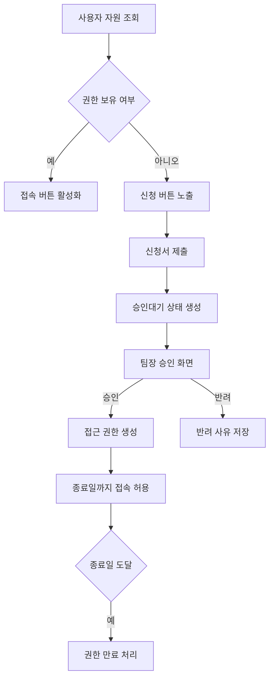

# 접근제어 기능 설계 초안

## 화면 IA

| 구분 | 경로 | 설명 |
|---|---|---|
| 사이드바 > 접근제어 > 접속 | `/p/access_control_access` | 사용자 자원 조회, 접속, 상세 확인 |
| 사이드바 > 접근제어 > 신청 | `/p/access_control_request` | 사용자 신청 작성, 내 신청 목록, 팀장 승인 처리 |
| 설정 > 접근제어 | `/admin/auth/access-control` | 관리자 자원/정책/권한/감사 로그 관리 |

## 와이어프레임 설명

### 1. 접속 페이지
- 좌측 메인 카드: 검색/필터 + 자원 목록 테이블
- 우측 상세 패널: 자원 기본정보, 필요 권한, 승인 상태, 유효기간, 신청 이력, 주의사항
- 액션 규칙:
  - 권한 보유 시 `접속`
  - 권한 없음 시 `신청`
  - 항상 `상세`

### 2. 신청 페이지
- 좌측 카드: 신청서 폼
- 우측 카드 상단: `내 신청` / `팀장 승인` 세그먼트 탭
- 우측 카드 하단: 선택한 신청의 상세, 승인 검토 결과, 과거 신청 이력

### 3. 관리자 설정 페이지
- 접근 자원 관리: 좌측 등록/수정 폼 + 우측 자원 목록
- 승인 정책 관리: 정책 값 편집 폼
- 권한 관리: 활성 권한 목록 + 권한 회수
- 감사 로그: 검색 필터 + 이력 테이블

## 테이블 컬럼 정의

### 접속 목록
- 자원명
- URL
- 설명
- 접근 상태
- 권한 만료일
- 최근 접속일
- 신청 여부
- 액션

### 신청 목록
- 신청번호
- 자원명
- URL
- 신청자
- 신청일
- 승인자
- 상태
- 반려사유
- 액션

### 팀장 승인 목록
- 신청번호
- 신청자
- 자원명
- URL
- 신청 사유
- 요청 기간
- 신청일
- 긴급 여부
- 액션

### 감사 로그
- 일시
- 사용자
- 대상 자원
- 행위
- 결과
- IP
- 비고

## 주요 버튼 및 액션 정의

| 버튼 | 위치 | 동작 |
|---|---|---|
| 접속 | 접속 페이지 | 권한 검증 후 접속 로그 기록, 외부 자원 오픈 |
| 신청 | 접속 페이지 | 신청 페이지로 자원 선택 상태 전달 |
| 상세 | 접속/신청 페이지 | 상세 패널 갱신 |
| 신청 제출 | 신청 페이지 | 승인대기 상태 신청 생성 |
| 취소 | 신청 페이지 | 본인 승인대기 신청 취소 |
| 재신청 | 신청 페이지 | 기존 신청값으로 폼 재채움 |
| 승인 | 신청 페이지 팀장 탭 | 승인 이력 기록 후 권한 생성 |
| 반려 | 신청 페이지 팀장 탭 | 반려사유 저장 |
| 저장 | 관리자 자원/정책 폼 | 자원/정책 저장 |
| 삭제 | 관리자 자원 목록 | 자원 소프트 삭제 |
| 회수 | 관리자 권한 목록 | 권한 즉시 차단 및 감사 로그 기록 |

## 상태값 정의

### 신청 상태
- `임시저장`
- `제출`
- `승인대기`
- `승인`
- `반려`
- `취소`
- `만료`

### 승인 상태
- `승인대기`
- `승인`
- `반려`

### 접속 상태
- `사용 가능`
- `승인 대기`
- `만료`
- `차단`

### 배지 컬러
- 승인/사용 가능: 녹색
- 승인대기: 주황/노랑
- 반려/취소: 빨강
- 만료/차단: 회색

## DB 테이블 초안

### `web_access_resource`
- 자원 마스터
- 확장 필드: `resource_type`, `launch_mode`, `security_level`, `default_period_days`, `approval_required`

### `web_access_policy`
- 승인 정책 싱글톤
- 필드: 팀장 승인 여부, 추가 관리자 승인 여부, 최대 기간, 긴급 허용, 만료 전 알림, 중복 제한

### `web_access_request`
- 신청 본문
- 신청자, 승인자, 기간, 사유, 상태, 반려 사유 저장

### `web_access_approval`
- 승인 단계 이력
- 단계 코드, 승인자, 의견, 반려 사유, 처리 시각 저장

### `web_access_grant`
- 실제 접근 권한
- 사용자/조직 기준으로 부여 가능
- 종료일 지나면 자동 만료

### `web_access_audit_log`
- 신청/승인/반려/접속/회수 감사 로그

### `web_access_request_attachment`
- 신청 첨부파일 메타데이터

## API 목록 초안

### 사용자
- `GET /api/access-control/resources`
- `GET /api/access-control/resources/{id}`
- `POST /api/access-control/resources/{id}/access`
- `GET /api/access-control/requests?scope=mine`
- `POST /api/access-control/requests`
- `GET /api/access-control/requests/{id}`
- `POST /api/access-control/requests/{id}/cancel`

### 팀장
- `GET /api/access-control/requests?scope=approvals`
- `POST /api/access-control/requests/{id}/approve`
- `POST /api/access-control/requests/{id}/reject`

### 관리자
- `POST /api/access-control/resources`
- `PUT /api/access-control/resources/{id}`
- `DELETE /api/access-control/resources/{id}`
- `GET /api/access-control/policy`
- `PUT /api/access-control/policy`
- `GET /api/access-control/grants`
- `POST /api/access-control/grants/{id}/revoke`
- `GET /api/access-control/audit-logs`

## 권한 흐름도

## 승인 프로세스 설명

1. 사용자가 권한 없는 자원을 선택해 신청서를 제출한다.
2. 신청 시 상태는 `승인대기`, 승인 단계는 `팀장 승인`으로 생성된다.
3. 신청자의 부서 `manager_emp_no`를 기준으로 팀장을 자동 지정한다.
4. 팀장이 승인하면 신청 상태는 `승인`, 승인 상태는 `승인`, 접근 권한은 `web_access_grant`에 생성된다.
5. 팀장이 반려하면 반려 사유를 필수 저장하고 신청 상태는 `반려`가 된다.
6. 권한 종료일이 지나면 배치성 만료 로직이 `만료`로 전환한다.
7. 모든 신청/승인/반려/접속/회수 이벤트는 감사 로그에 적재된다.